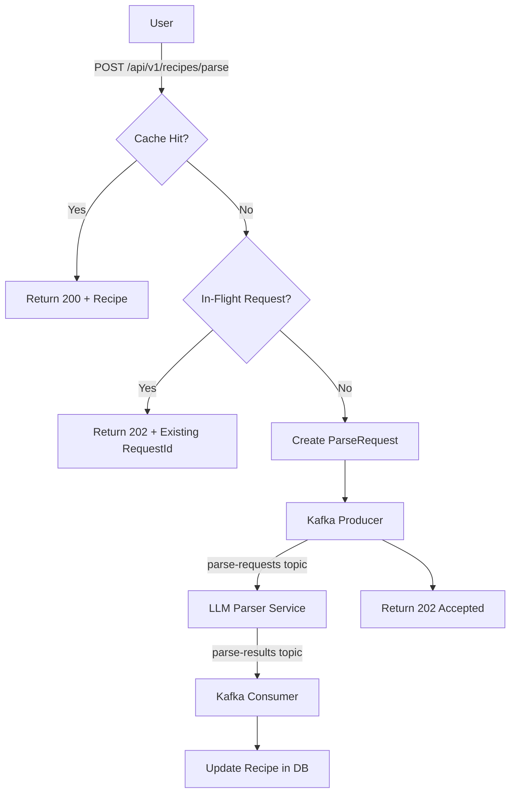

# HomeChef

A recipe ingredient extraction application that parses recipe URLs and extracts structured ingredient data using LLM-powered parsing. Built with a modern polyglot stack following Hexagonal Architecture principles.

## Table of Contents

- [Overview](#overview)
- [Architecture](#architecture)
- [Tech Stack](#tech-stack)
- [Project Structure](#project-structure)
- [Requirements](#requirements)
- [Getting Started](#getting-started)
- [Running the Application](#running-the-application)
- [API Reference](#api-reference)
- [Database Schema](#database-schema)
- [Configuration](#configuration)
- [Observability](#observability)
- [Testing](#testing)
- [Development](#development)

## Overview

HomeChef allows users to submit recipe URLs and receive structured ingredient lists. The application:

1. Accepts a recipe URL from the user
2. Checks cache for previously parsed recipes
3. If not cached, sends a parse request via Kafka to an LLM parser service
4. Returns structured ingredient data (quantity, unit, name)

Key features:
- **Async Processing**: Non-blocking recipe parsing via Kafka message queue
- **Deduplication**: In-flight request deduplication prevents duplicate parsing
- **Caching**: Previously parsed recipes are cached with configurable TTL (default: 30 days)
- **JWT Authentication**: Secure user registration and login
- **Internationalization**: Frontend supports multiple languages (EN/PL)
- **Full Observability**: Prometheus metrics, Grafana dashboards, Loki logs

## Architecture

The backend follows **Hexagonal Architecture** (Ports & Adapters), separating domain logic from infrastructure concerns. Input adapters (REST, Kafka consumers) call application services through port interfaces, which interact with domain entities and output adapters (repositories, Kafka producers).

### Request Flow



## Tech Stack

### Backend (Java 17 / Spring Boot 4.0)

| Component | Technology |
|-----------|------------|
| Framework | Spring Boot 4.0 |
| Language | Java 17 |
| Database | PostgreSQL 16 |
| Cache | Redis 7 |
| Messaging | Apache Kafka 3.7 (KRaft mode) |
| Migrations | Flyway |
| Security | Spring Security + JWT (JJWT 0.12.5) |
| Metrics | Micrometer + Prometheus |
| Logging | Logback + Logstash JSON encoder |
| API Docs | OpenAPI 3 (SpringDoc) |
| Testing | JUnit 5, TestContainers, ArchUnit |

### Frontend (React 19 / TypeScript 5.9)

| Component | Technology |
|-----------|------------|
| Framework | React 19 |
| Build Tool | Vite 7 |
| Language | TypeScript 5.9 |
| Styling | Tailwind CSS 4 |
| i18n | i18next |
| Linting | ESLint 9 |

### Infrastructure (Docker Compose)

| Service | Image | Port |
|---------|-------|------|
| PostgreSQL | postgres:16 | 5433 |
| Redis | redis:7 | 6380 |
| Kafka | apache/kafka:3.7.0 | 9092, 29092 |
| Kafka UI | provectuslabs/kafka-ui | 9094 |
| Prometheus | prom/prometheus | 9991 |
| Grafana | grafana/grafana | 9990 |
| Loki | grafana/loki | 9993 |
| Node Exporter | prom/node-exporter | 9992 |

## Project Structure

```
homechef/
├── core/                              # Backend application
│   ├── src/main/java/.../core/
│   │   ├── adapter/in/                # REST controllers, Kafka consumers, JWT filter
│   │   ├── adapter/out/               # Repositories, Kafka producers
│   │   ├── application/               # Use cases, ports, services
│   │   ├── domain/                    # Domain entities (Recipe, User, Ingredient)
│   │   └── config/                    # Spring configuration
│   ├── src/main/resources/db/migration/   # Flyway migrations
│   ├── src/main/front/homechef-app/   # React frontend
│   ├── Dockerfile
│   └── pom.xml
│
├── infrastructure/                    # Docker Compose & configs
│   ├── docker-compose.yml
│   └── config/                        # Grafana, Prometheus, Promtail configs
│
└── README.md
```

## Requirements

- **Java 17+** (Eclipse Temurin recommended)
- **Maven 3.8+** (or use included `mvnw` wrapper)
- **Node.js 20+** and **npm 10+** (for frontend)
- **Docker** and **Docker Compose** (for infrastructure)

## Getting Started

### 1. Clone the Repository

```bash
git clone https://github.com/MichalOleniacz/homechef.git
cd homechef
```

### 2. Start Infrastructure

```bash
cd infrastructure

# Start all infrastructure (DB, cache, messaging, observability)
docker compose --profile infra up -d

# Or start everything including the app
docker compose --profile all up -d
```

### 3. Run Backend (Development)

```bash
cd core

# Set required environment variable
export JWT_SECRET="your-secret-key-minimum-32-characters"

# Run with Maven
./mvnw spring-boot:run
```

The API will be available at `http://localhost:8000`

### 4. Run Frontend (Development)

```bash
cd core/src/main/front/homechef-app

npm install
npm run dev
```

The frontend will be available at `http://localhost:5173`

## Running the Application

### Docker Compose Profiles

| Profile | Services |
|---------|----------|
| `db` | PostgreSQL, Redis, exporters |
| `infra` | db + Kafka, Kafka UI |
| `ops` | Grafana, Prometheus, Loki, Promtail |
| `all` | Everything + Core application |
| `full` | Everything except Core (run locally) |
| `core` | Dev mode Core with hot-reload |

```bash
# Development: run infra in Docker, backend locally
docker compose --profile full up -d
cd ../core && ./mvnw spring-boot:run

# Production-like: everything in Docker
docker compose --profile all up -d

# Dev mode with hot-reload
docker compose --profile infra --profile core up -d
```

### Port Reference

| Service | Port | Description |
|---------|------|-------------|
| Core API | 8000 | REST API |
| Frontend | 5173 | Vite dev server |
| PostgreSQL | 5433 | Database (mapped from 5432) |
| Redis | 6380 | Cache (mapped from 6379) |
| Kafka | 29092 | Host access (9092 internal) |
| Kafka UI | 9094 | Kafka management UI |
| Grafana | 9990 | Dashboards |
| Prometheus | 9991 | Metrics |
| Node Exporter | 9992 | Host metrics |
| Loki | 9993 | Log aggregation |

## API Reference

### Authentication

#### Register User
```http
POST /auth/register
Content-Type: application/json

{
  "email": "user@example.com",
  "password": "securepassword"
}
```

Response (201 Created):
```json
{
  "userId": "uuid",
  "email": "user@example.com",
  "accessToken": "eyJhbGc...",
  "expiresIn": 3600
}
```

#### Login
```http
POST /auth/login
Content-Type: application/json

{
  "email": "user@example.com",
  "password": "securepassword"
}
```

Response (200 OK):
```json
{
  "userId": "uuid",
  "email": "user@example.com",
  "accessToken": "eyJhbGc...",
  "expiresIn": 3600
}
```

### Recipe Parsing

#### Submit URL for Parsing (Public)
```http
POST /api/v1/recipes/parse
Content-Type: application/json

{
  "url": "https://example.com/recipe/chocolate-cake"
}
```

Response (200 OK - cached):
```json
{
  "status": "COMPLETED",
  "recipe": {
    "title": "Chocolate Cake",
    "ingredients": [
      { "quantity": "2", "unit": "cups", "name": "flour" },
      { "quantity": "1", "unit": "cup", "name": "sugar" }
    ]
  }
}
```

Response (202 Accepted - processing):
```json
{
  "status": "PENDING",
  "requestId": "uuid"
}
```

#### Poll Parse Status
```http
GET /api/v1/recipes/parse-requests/{requestId}
```

Response (200 OK):
```json
{
  "status": "COMPLETED",
  "recipe": { ... }
}
```

### OpenAPI Documentation

- **Swagger UI**: http://localhost:8000/swagger-ui.html
- **OpenAPI Spec**: http://localhost:8000/v3/api-docs

## Database Schema

### Tables

#### `resource`
Tracks known recipe URLs.

| Column | Type | Description |
|--------|------|-------------|
| url_hash | VARCHAR(64) PK | SHA-256 hash of normalized URL |
| url | TEXT | Original URL |
| created_at | TIMESTAMPTZ | Creation timestamp |

#### `recipe`
Stores parsed recipe data (1:1 with resource).

| Column | Type | Description |
|--------|------|-------------|
| url_hash | VARCHAR(64) PK/FK | References resource |
| title | VARCHAR(500) | Recipe title |
| ingredients | JSONB | Array of {quantity, unit, name} |
| parsed_at | TIMESTAMPTZ | TTL anchor |

#### `parse_request`
Tracks lifecycle of parsing attempts.

| Column | Type | Description |
|--------|------|-------------|
| id | UUID PK | Request identifier |
| user_id | UUID | NULL for guests |
| url_hash | VARCHAR(64) FK | References resource |
| status | VARCHAR(20) | PENDING/PROCESSING/COMPLETED/FAILED |
| error_message | TEXT | Error details if failed |
| created_at | TIMESTAMPTZ | Creation timestamp |
| updated_at | TIMESTAMPTZ | Last update |

#### `app_user`
User authentication.

| Column | Type | Description |
|--------|------|-------------|
| id | VARCHAR(36) PK | User UUID |
| email | VARCHAR(255) UNIQUE | User email |
| password_hash | VARCHAR(255) | BCrypt hash |
| created_at | TIMESTAMPTZ | Registration timestamp |

## Configuration

### Environment Variables

| Variable | Required | Default | Description |
|----------|----------|---------|-------------|
| `JWT_SECRET` | Yes | - | JWT signing key (min 32 chars) |
| `SPRING_DATASOURCE_URL` | No | jdbc:postgresql://localhost:5432/core | PostgreSQL URL |
| `SPRING_DATASOURCE_USERNAME` | No | postgres | DB username |
| `SPRING_DATASOURCE_PASSWORD` | No | postgres | DB password |
| `SPRING_DATA_REDIS_HOST` | No | localhost | Redis host |
| `SPRING_DATA_REDIS_PORT` | No | 6379 | Redis port |
| `KAFKA_BOOTSTRAP_SERVERS` | No | localhost:29092 | Kafka brokers |

### Application Properties

Key configurations in `application.properties`:

```properties
# Server
server.port=8000

# Recipe TTL
homechef.recipe.ttl-days=30

# Kafka Topics
homechef.kafka.topic.parse-request=parse-requests
homechef.kafka.topic.parse-result=parse-results

# JWT
app.jwt.expiration-seconds=3600

# Recipe Import (optional)
homechef.import.recipes-file=${HOMECHEF_IMPORT_RECIPES_FILE:}
homechef.import.enabled=${HOMECHEF_IMPORT_ENABLED:true}
```

## Observability

### Metrics (Prometheus)

Access metrics at:
- **Raw metrics**: http://localhost:8000/actuator/prometheus
- **Prometheus UI**: http://localhost:9991

Key metrics:

| Metric | Type | Description |
|--------|------|-------------|
| `recipe_submit_total` | Counter | Total recipe submissions by outcome |
| `http_server_requests_seconds` | Summary | HTTP request latency |
| `hikaricp_connections_*` | Gauge | Database connection pool |
| `jvm_memory_used_bytes` | Gauge | JVM memory usage |
| `kafka_consumer_fetch_manager_records_lag` | Gauge | Kafka consumer lag |

### Dashboards (Grafana)

Access Grafana at http://localhost:9990 (admin/admin)

Pre-provisioned dashboards:
- **HomeChef Core - Health**: Application metrics, JVM, DB connections, Kafka, Redis
- **Node Exporter**: Host system metrics

### Logs (Loki)

Logs are collected via Promtail and stored in Loki. Query in Grafana Explore:

```logql
{container_name="homechef-core"} |= "error"
```

Log format is JSON (structured) for easy querying:
```json
{
  "timestamp": "2024-01-24T12:00:00.000Z",
  "level": "INFO",
  "logger": "o.h.c.a.in.web.RecipeController",
  "message": "Received URL submission request",
  "url": "https://example.com/recipe",
  "requestId": "uuid"
}
```

### Health Endpoints

| Endpoint | Description |
|----------|-------------|
| `/actuator/health` | Application health status |
| `/actuator/info` | Application info |
| `/actuator/prometheus` | Prometheus metrics |
| `/actuator/metrics` | Micrometer metrics |

## Testing

### Backend Tests

```bash
cd core

# Run all tests
./mvnw test

# Run with coverage
./mvnw test jacoco:report

# Run integration tests (requires Docker for TestContainers)
./mvnw verify -P integration-tests
```

Test types:
- **Unit tests**: Domain logic, services
- **Integration tests**: Repository tests with TestContainers (PostgreSQL, Kafka)
- **Architecture tests**: ArchUnit rules enforcing hexagonal boundaries

### Frontend Tests

```bash
cd core/src/main/front/homechef-app

npm run lint
npm run build  # Type checking
```

## Development

### Code Style

- **Backend**: Standard Java conventions, immutable records for DTOs
- **Frontend**: ESLint + Prettier, strict TypeScript

### Architecture Rules (ArchUnit)

The codebase enforces hexagonal architecture boundaries:
- Domain layer has no external dependencies
- Adapters depend on application layer, not vice versa
- Use cases are accessed through port interfaces

### Hot Reload

**Backend** (with `spring-boot-devtools`):
```bash
./mvnw spring-boot:run
```

**Frontend** (Vite HMR):
```bash
npm run dev
```

### Recipe Import

Import recipes from JSON file on startup:
```bash
export HOMECHEF_IMPORT_RECIPES_FILE=file:/path/to/recipes.json
./mvnw spring-boot:run
```

JSON format:
```json
[
  {
    "url": "https://example.com/recipe/cake",
    "title": "Chocolate Cake",
    "ingredients": [
      { "quantity": "2", "unit": "cups", "name": "flour" }
    ]
  }
]
```

---

## License

MIT

## Contributing

1. Fork the repository
2. Create a feature branch (`git checkout -b feature/amazing-feature`)
3. Commit changes (`git commit -m 'Add amazing feature'`)
4. Push to branch (`git push origin feature/amazing-feature`)
5. Open a Pull Request
